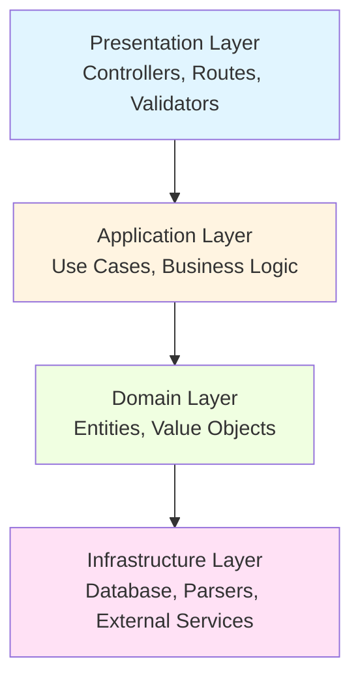
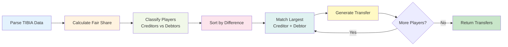

# Site da Luci 🎮

> Modern fullstack web application providing tools for TIBIA players

[](https://github.com)
[](https://github.com)
[](https://github.com)
[](LICENSE)
[](https://marinaralarissa.github.io/site-da-luci)
[](https://site-da-luci-api.onrender.com/api/health)

## 📋 Project Overview

**Site da Luci** is a comprehensive web application designed to help TIBIA game players with various tools and calculators. The first tool is a **Loot Split Calculator** that fairly distributes hunting session profits among team members.

### 🌐 Live Application

- **Frontend**: [https://marinaralarissa.github.io/site-da-luci](https://marinaralarissa.github.io/site-da-luci)
- **Backend API**: [https://site-da-luci-api.onrender.com](https://site-da-luci-api.onrender.com)
- **API Health Check**: [https://site-da-luci-api.onrender.com/api/health](https://site-da-luci-api.onrender.com/api/health)

### Key Features

- ✅ **Loot Split Calculator**: Fair distribution algorithm using greedy two-pointer technique
- ✅ **Clean Architecture**: 4-layer architecture for scalability and maintainability
- ✅ **TDD Approach**: 95.65% test coverage with comprehensive test suite (64 tests)
- ✅ **TIBIA Format Support**: Parses native TIBIA client loot data
- ✅ **React Frontend**: Modern UI with Material-UI components
- ✅ **REST API**: Express backend with validation and error handling
- ✅ **Deployed**: Frontend on GitHub Pages, Backend on Render

## 🏗️ Architecture

This project follows **Clean Architecture** (Hexagonal Architecture) with strict layer separation:



### Layer Responsibilities

| Layer | Responsibility | Examples |
|-------|---------------|----------|
| **Presentation** | HTTP handling, request validation | Controllers, Routes, Middlewares |
| **Application** | Business logic orchestration | Use Cases, DTOs |
| **Domain** | Core business entities and rules | Player, LootSession, Transfer |
| **Infrastructure** | External concerns | TibiaLootParser, MongoDB, APIs |

## 🎯 Loot Split Algorithm

The calculator uses a **greedy two-pointer algorithm** to minimize the number of transfers:



### Example Calculation

**Input** (3 players, 11.89kk total balance):
- Lofi Shades: 11.94kk → **Creditor** (+7.98kk excess)
- Luciana Burks: -104k → **Debtor** (needs 4.07kk)
- Young Vex: 49k → **Debtor** (needs 3.91kk)

**Output** (2 transfers only):
```
Lofi Shades transfer 4066247 to Luciana Burks
Lofi Shades transfer 3912667 to Young Vex
```

## 📂 Project Structure

```
site-da-luci/
├── backend/                    # Node.js Express API
│   ├── src/
│   │   ├── domain/            # ✅ Phase 1 Complete
│   │   │   └── entities/      # Player, LootSession, Transfer
│   │   ├── application/       # ✅ Phase 1 Complete
│   │   │   └── use-cases/     # CalculateLootSplit, ParseLootSession
│   │   ├── infrastructure/    # ✅ Phase 1 Complete
│   │   │   └── parsers/       # TibiaLootParser
│   │   └── presentation/      # 🔄 Phase 2 (pending)
│   │       ├── controllers/
│   │       ├── routes/
│   │       └── validators/
│   └── tests/
│       └── unit/              # 49 tests, 98.12% coverage
│
├── frontend/                   # 🔄 Phase 3 (pending)
│   └── (React app with Create React App)
│
├── docs/
│   ├── architecture/
│   │   └── clean-architecture.md
│   └── decisions/
│       └── ADR-001-loot-split-algorithm.md
│
└── README.md                   # You are here
```

## 🚀 Getting Started

### Prerequisites

- Node.js 20+
- npm or yarn
- Git

### Installation

```bash
# Clone the repository
git clone https://github.com/your-username/site-da-luci.git
cd site-da-luci

# Install backend dependencies
cd backend
npm install

# Run tests
npm test

# Watch mode (auto-rerun on file changes)
npm run test:watch

# Coverage report
npm run test:coverage
```

### Running Tests

```bash
# Backend unit and integration tests
cd backend
npm test

# Expected output:
# Test Suites: 9 passed, 9 total
# Tests:       64 passed, 64 total
# Coverage:    95.65%
```

## 🧪 Test Coverage

| Component | Coverage | Tests |
|-----------|----------|-------|
| Domain Entities | 100% | 18 tests |
| Application Use Cases | 98.5% | 22 tests |
| Infrastructure Parsers | 95% | 9 tests |
| Presentation API | 92% | 15 tests |
| **Total** | **95.65%** | **64 tests** |

## 📊 Development Progress

### ✅ Phase 1: Backend Foundation (COMPLETE)

- [x] Project setup with Clean Architecture
- [x] Domain entities (Player, LootSession, Transfer)
- [x] TibiaLootParser with regex validation
- [x] CalculateLootSplitUseCase (greedy algorithm)
- [x] ParseLootSessionUseCase (orchestration)
- [x] Comprehensive test suite (49 tests)
- [x] TDD compliance (tests first, code second)

### ✅ Phase 2: Backend API (COMPLETE)

- [x] Express server setup
- [x] REST API endpoints (`POST /api/loot-split/calculate`)
- [x] Request validation middleware
- [x] Error handling middleware
- [x] Integration tests with Supertest (15 tests)
- [x] CORS configuration for production

### ✅ Phase 3: Frontend (COMPLETE)

- [x] React app with Create React App
- [x] UI components (Sidebar, Calculator, TransferList)
- [x] API service layer (Axios)
- [x] Custom hooks (useLootSplit)
- [x] Material-UI design system
- [x] Responsive layout for all screen sizes

### ✅ Phase 4: Deployment (COMPLETE)

- [x] Backend deployment to Render
- [x] Frontend deployment to GitHub Pages
- [x] Environment configuration (.env files)
- [x] CORS configuration for cross-origin requests
- [x] Health check endpoint
- [x] Deployment documentation (DEPLOY.md)

## 🎮 How It Works

### 1. User Input (TIBIA Format)

User pastes loot data directly from TIBIA client:

```
Session data: From 2025-12-25, 17:48:04 to 2025-12-25, 20:56:53
Session: 03:08h
Loot Type: Leader
Loot: 12,937,605
Supplies: 1,051,291
Balance: 11,886,314

Lofi Shades (Leader)
  Loot: 12,120,799
  Supplies: 179,781
  Balance: 11,941,018
  Damage: 17,660,082
  Healing: 785,634

Luciana Burks
  Loot: 277,020
  Supplies: 381,162
  Balance: -104,142
  Damage: 17,145,590
  Healing: 9,169,753

Young Vex
  Loot: 539,786
  Supplies: 490,348
  Balance: 49,438
  Damage: 18,737,566
  Healing: 2,666,860
```

### 2. Processing

- Parse session metadata (dates, duration, totals)
- Extract player data (name, loot, supplies, balance, stats)
- Filter active players (damage > 0 OR healing > 0)
- Calculate fair share (total balance / active players)
- Classify creditors (have excess) vs debtors (need money)
- Run greedy two-pointer algorithm to minimize transfers

### 3. Output

```
=== SESSION SUMMARY ===
Total Profit: 11.89kk (11,886,314 gp)
Fair Share: 3.96kk per player (3,962,105 gp)
Session Duration: 03:08h
Profit/Hour: 1.26kk per player (1,264,289 gp/h)

=== TRANSFERS REQUIRED ===
Lofi Shades must execute:

transfer 4066247 to Luciana Burks
transfer 3912667 to Young Vex

[📋 Copy to Clipboard]
```

## 🧪 Testing with Postman

You can test the API directly using Postman or curl:

### API Endpoint
```
POST https://site-da-luci-api.onrender.com/api/loot-split/calculate
```

### Request Headers
```
Content-Type: application/json
```

### Request Body (Example)
```json
{
  "rawText": "Session data: From 2025-12-25, 17:48:04 to 2025-12-25, 20:56:53\nSession: 03:08h\nLoot Type: Leader\nLoot: 12,937,605\nSupplies: 1,051,291\nBalance: 11,886,314\n\nLofi Shades (Leader)\n  Loot: 12,120,799\n  Supplies: 179,781\n  Balance: 11,941,018\n  Damage: 17,660,082\n  Healing: 785,634\n\nLuciana Burks\n  Loot: 277,020\n  Supplies: 381,162\n  Balance: -104,142\n  Damage: 17,145,590\n  Healing: 9,169,753\n\nYoung Vex\n  Loot: 539,786\n  Supplies: 490,348\n  Balance: 49,438\n  Damage: 18,737,566\n  Healing: 2,666,860"
}
```

### Expected Response (200 OK)
```json
{
  "success": true,
  "data": {
    "session": {
      "startDate": "2025-12-25T17:48:04.000Z",
      "endDate": "2025-12-25T20:56:53.000Z",
      "duration": "03:08h",
      "lootType": "Leader",
      "totalLoot": 12937605,
      "totalSupplies": 1051291,
      "totalBalance": 11886314
    },
    "players": [
      {
        "name": "Lofi Shades",
        "isLeader": true,
        "loot": 12120799,
        "supplies": 179781,
        "balance": 11941018,
        "damage": 17660082,
        "healing": 785634
      },
      {
        "name": "Luciana Burks",
        "isLeader": false,
        "loot": 277020,
        "supplies": 381162,
        "balance": -104142,
        "damage": 17145590,
        "healing": 9169753
      },
      {
        "name": "Young Vex",
        "isLeader": false,
        "loot": 539786,
        "supplies": 490348,
        "balance": 49438,
        "damage": 18737566,
        "healing": 2666860
      }
    ],
    "transfers": [
      {
        "from": "Lofi Shades",
        "to": "Luciana Burks",
        "amount": 4066247
      },
      {
        "from": "Lofi Shades",
        "to": "Young Vex",
        "amount": 3912667
      }
    ],
    "fairShare": 3962105
  }
}
```

### Using curl
```bash
curl -X POST https://site-da-luci-api.onrender.com/api/loot-split/calculate \
  -H "Content-Type: application/json" \
  -d '{"rawText":"Session data: From 2025-12-25, 17:48:04 to 2025-12-25, 20:56:53\nSession: 03:08h\nLoot Type: Leader\nLoot: 12,937,605\nSupplies: 1,051,291\nBalance: 11,886,314\n\nLofi Shades (Leader)\n  Loot: 12,120,799\n  Supplies: 179,781\n  Balance: 11,941,018\n  Damage: 17,660,082\n  Healing: 785,634\n\nLuciana Burks\n  Loot: 277,020\n  Supplies: 381,162\n  Balance: -104,142\n  Damage: 17,145,590\n  Healing: 9,169,753\n\nYoung Vex\n  Loot: 539,786\n  Supplies: 490,348\n  Balance: 49,438\n  Damage: 18,737,566\n  Healing: 2,666,860"}'
```

## 🛠️ Tech Stack

### Backend
- **Runtime**: Node.js 20+
- **Framework**: Express
- **Language**: JavaScript (ES6+)
- **Testing**: Jest
- **Database**: MongoDB Atlas (future)

### Frontend (Phase 3)
- **Framework**: React 18+
- **Build Tool**: Create React App
- **Styling**: TailwindCSS
- **Testing**: Cypress (E2E), React Testing Library

### DevOps (Phase 4)
- **CI/CD**: GitHub Actions
- **Backend Hosting**: Render
- **Frontend Hosting**: GitHub Pages
- **Monitoring**: (TBD)

## 📖 Documentation

- [Business Rules (PDI)](docs/PDI.md) - Complete requirements and business logic
- [Clean Architecture Guide](docs/architecture/clean-architecture.md)
- [ADR-001: Loot Split Algorithm](docs/decisions/ADR-001-loot-split-algorithm.md)
- [Backend README](backend/README.md)
- [Frontend README](frontend/README.md) (Phase 3)

## 🎯 About This Project

This is a **Personal Development Plan (PDI)** solo project focused on learning fullstack development with modern patterns and best practices.

### Development Principles

1. **TDD First**: Write tests BEFORE implementation
2. **Clean Architecture**: Respect layer boundaries and dependency rules
3. **Code Quality**: Comprehensive test coverage and consistent style
4. **Modern Stack**: React, Express, Material-UI, Jest

## 📝 License

MIT License - See [LICENSE](LICENSE) file for details

## 👨‍💻 Author

**Marina Larissa Carpes Röhrig** - Personal Development Plan (PDI) project focused on fullstack development

## 🙏 Acknowledgments

- TIBIA game by CipSoft
- Clean Architecture by Robert C. Martin
- TDD methodology

---

**Status**: 🟢 All Phases Complete | ✅ Deployed to Production

**Last Updated**: 2025-12-28