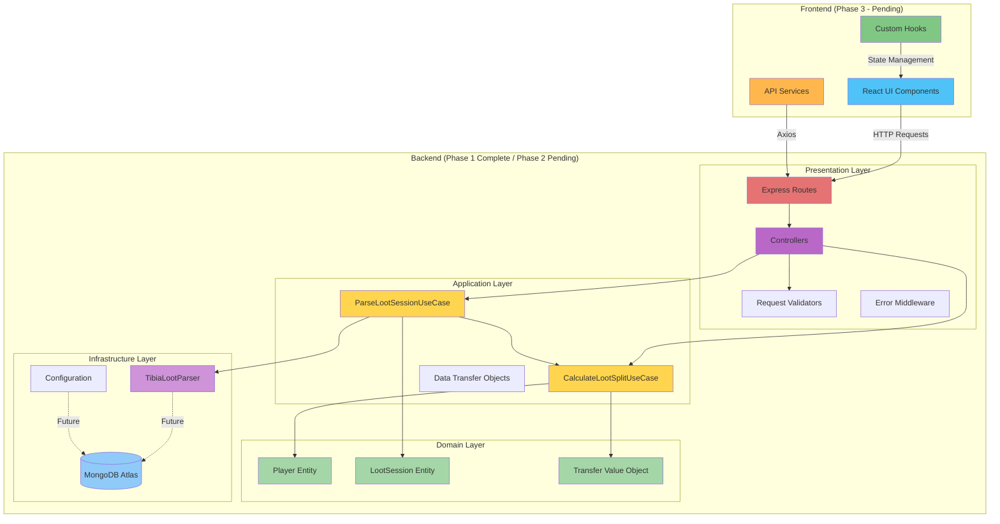
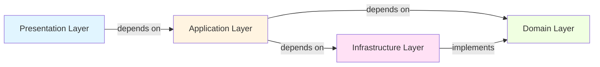
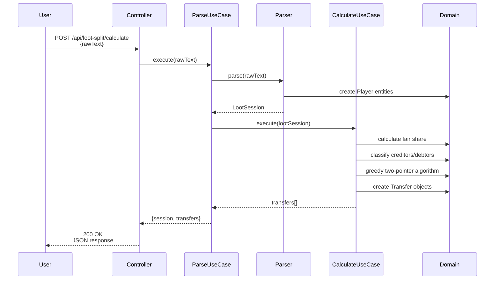
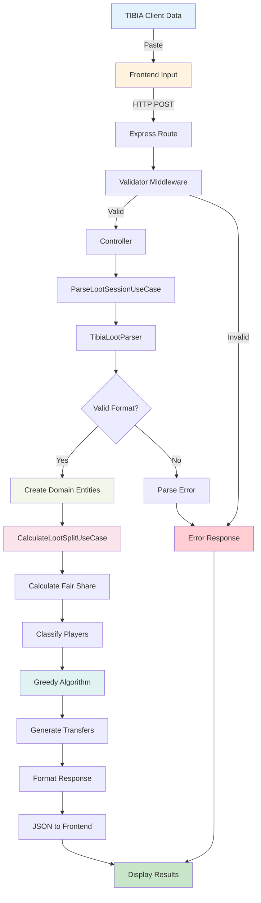
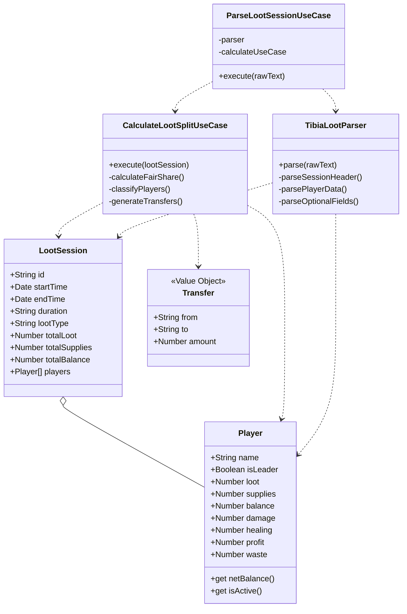
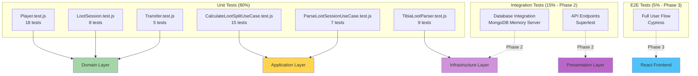
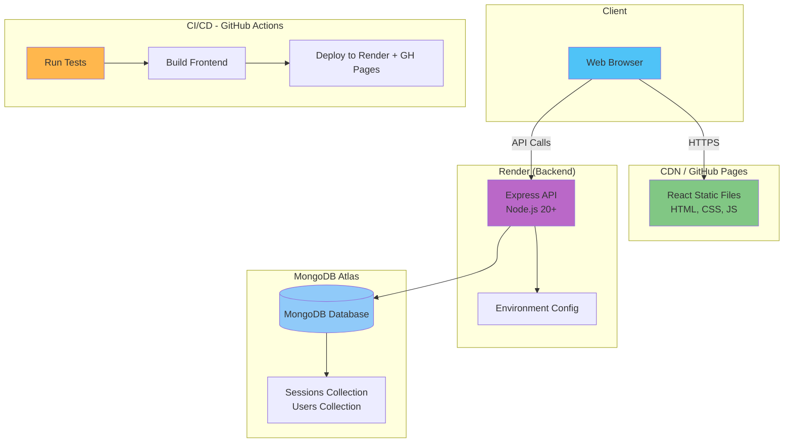
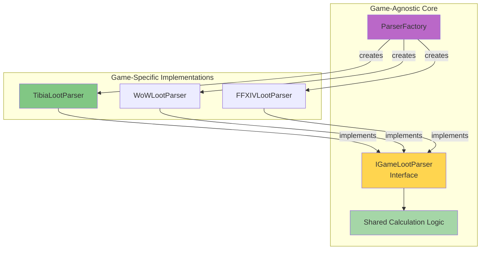

# Site da Luci - Architecture Diagram

## System Architecture Overview



## Layer Dependencies (Clean Architecture)



**Key Principle**: Dependencies always point INWARD. Domain Layer has ZERO dependencies.

## Loot Split Calculator Flow (Phase 1)



## Data Flow Architecture



## Domain Model (Phase 1 Complete)



## Algorithm Visualization (Greedy Two-Pointer)

```mermaid
flowchart TD
    Start([Start: LootSession]) --> Filter[Filter Active Players]
    Filter --> CalcShare[Calculate Fair Share<br/>totalBalance / activePlayers]
    CalcShare --> CalcDiff[Calculate Differences<br/>netBalance - fairShare]

    CalcDiff --> Split{Split Players}
    Split -->|difference > 0| Creditors[Creditors Array<br/>Sort DESC]
    Split -->|difference < 0| Debtors[Debtors Array<br/>Sort ASC]

    Creditors --> TwoPointer[Two-Pointer Algorithm]
    Debtors --> TwoPointer

    TwoPointer --> Match[Match Largest<br/>Creditor + Debtor]
    Match --> CalcAmount[amountToTransfer =<br/>min(abs(debtor), creditor)]
    CalcAmount --> CreateTransfer[Create Transfer Object<br/>from: creditor<br/>to: debtor<br/>amount: rounded]

    CreateTransfer --> UpdateDiff[Update Differences<br/>debtor += amount<br/>creditor -= amount]
    UpdateDiff --> CheckZero{Difference = 0?}

    CheckZero -->|Debtor = 0| IncDebtor[debtorIndex++]
    CheckZero -->|Creditor = 0| IncCreditor[creditorIndex++]
    CheckZero -->|Both = 0| IncBoth[Both indexes++]

    IncDebtor --> MorePlayers{More Players?}
    IncCreditor --> MorePlayers
    IncBoth --> MorePlayers

    MorePlayers -->|Yes| Match
    MorePlayers -->|No| Sort[Sort Transfers<br/>by amount DESC]
    Sort --> Group[Group by Sender]
    Group --> End([Return Transfers])

    style Start fill:#4caf50
    style Filter fill:#81c784
    style CalcShare fill:#aed581
    style Split fill:#ffeb3b
    style Creditors fill:#ff9800
    style Debtors fill:#f44336
    style TwoPointer fill:#9c27b0
    style CreateTransfer fill:#2196f3
    style End fill:#4caf50
```

## Test Architecture (TDD - Phase 1)



## Deployment Architecture (Phase 4 - Future)



## Future Scalability (Multi-Game Support)



---

**Generated**: 2025-12-26
**Phase**: 1 Complete (Backend Foundation)
**Next**: Phase 2 (Backend API)