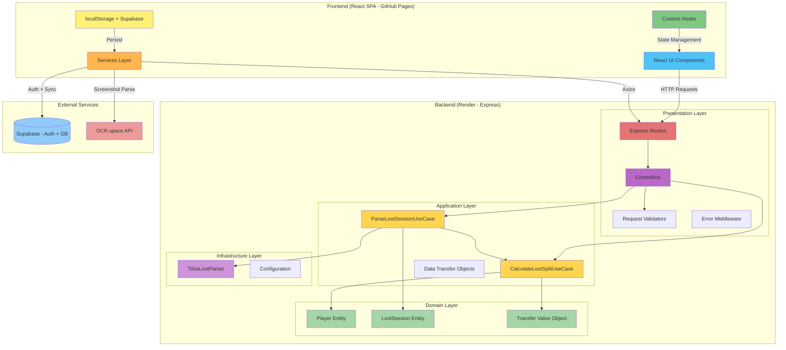
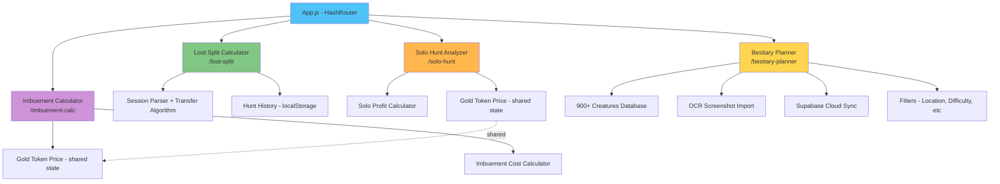
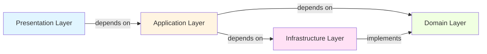
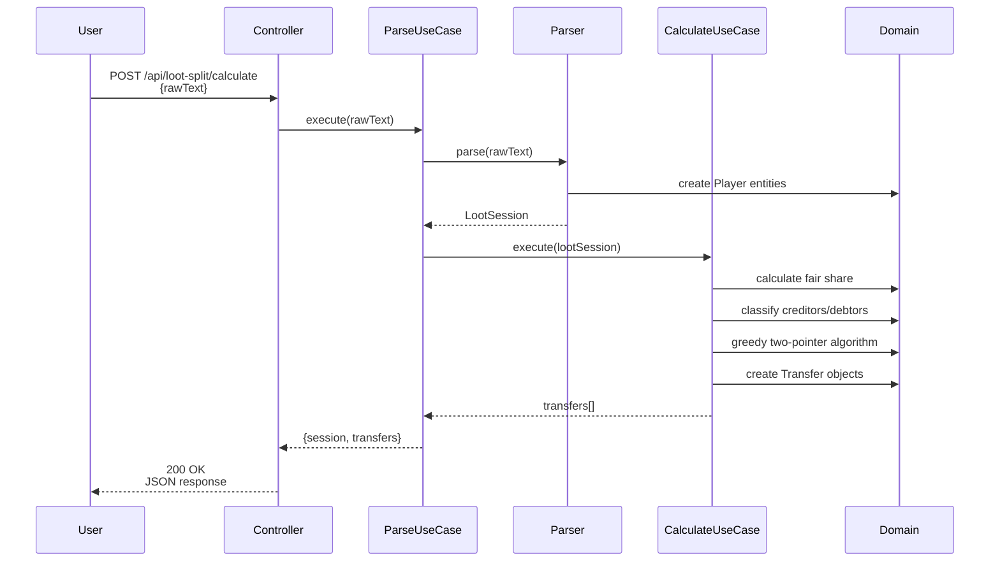
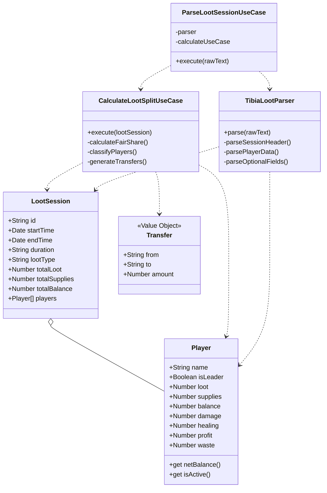
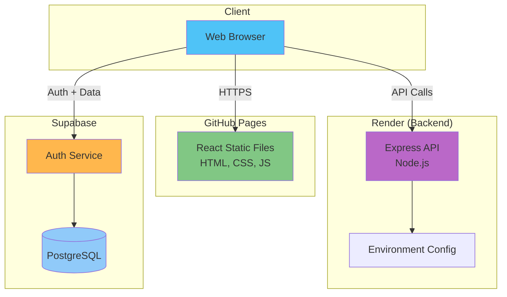
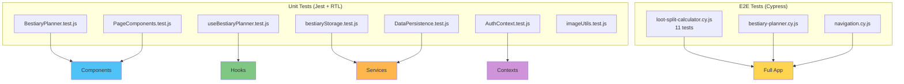

# Site da Luci - Architecture Diagram

## System Architecture Overview

## Frontend Features (All Implemented)

## Layer Dependencies (Clean Architecture)

**Key Principle**: Dependencies always point INWARD. Domain Layer has ZERO dependencies.

## Loot Split Calculator Flow

## Domain Model

## Deployment Architecture

## Test Architecture

---

**Last Updated**: 2026-02-10
**Status**: Frontend complete (4 tools), Backend foundation complete, Supabase integrated
